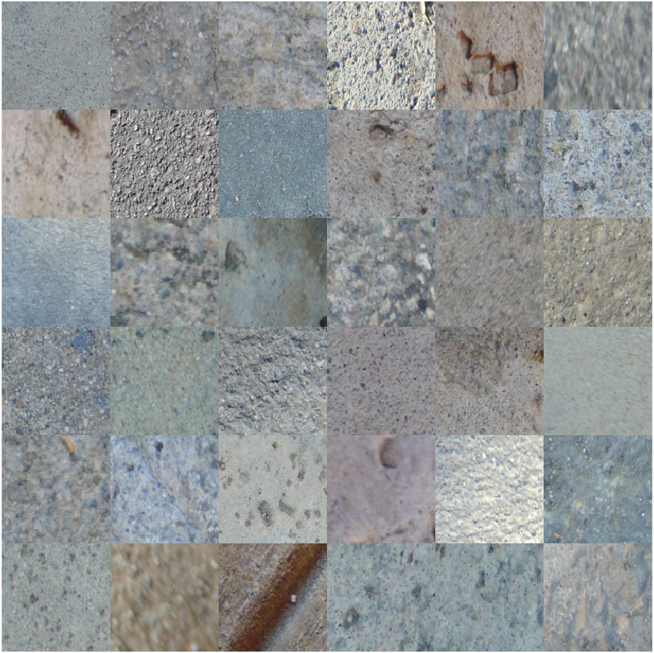
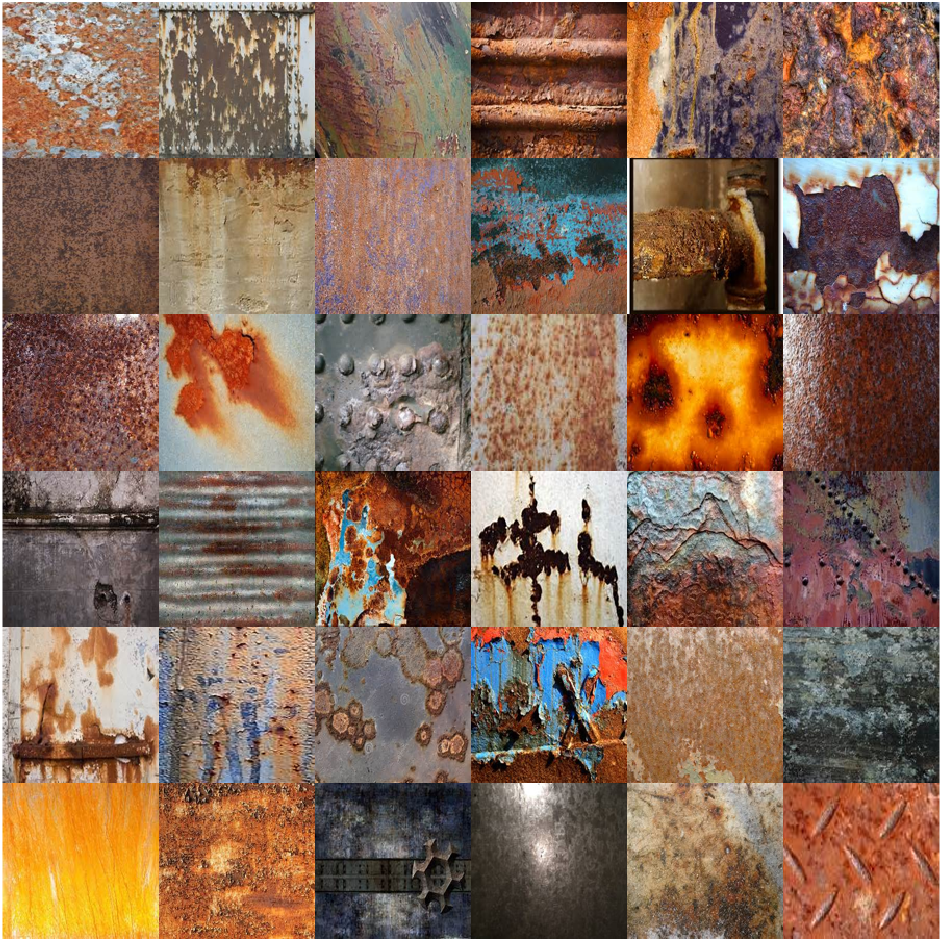
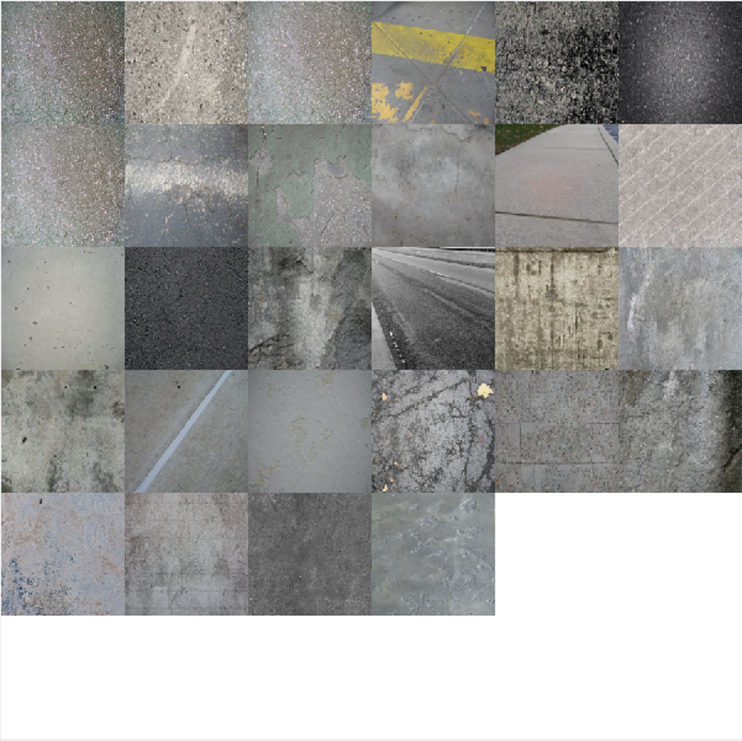
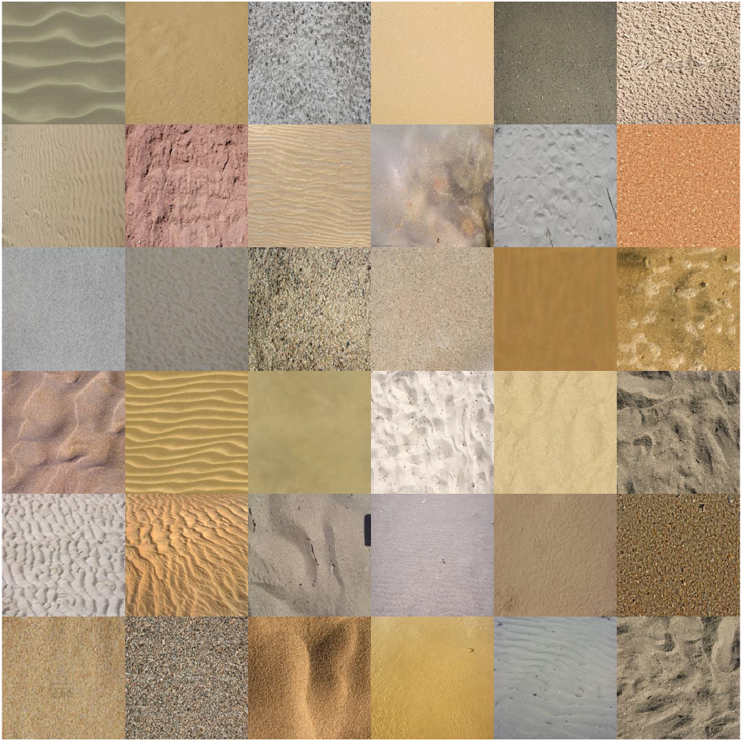
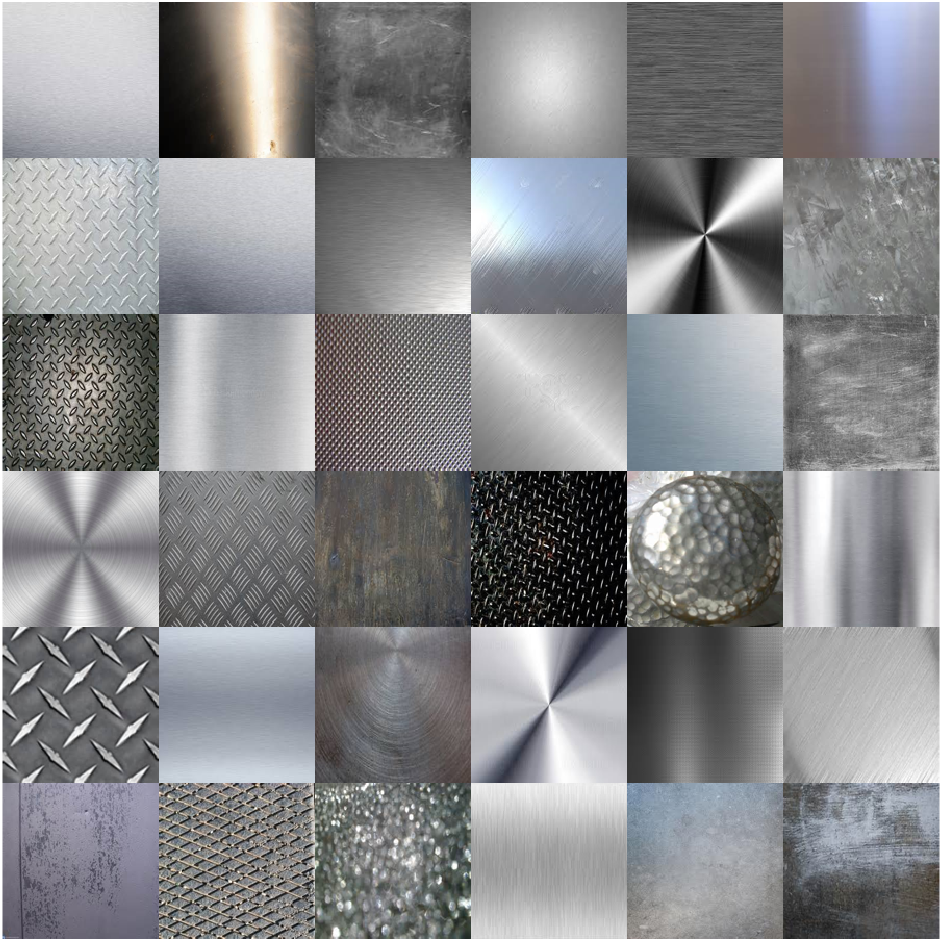

# Texture datasets
Cracks are the defects formed by cyclic loading, fatigue, shrinkage, creep, and so on. In addition, they represent the deterioration of the structures over some time. Therefore, it is essential to detect and classify them according to the condition grade at the early stages to prevent the collapse of structures. Deep learning and machine learning-based supervised classification methods requires carefully annotated images of cracks. This is a repository of human annotated classification datasets of concrete, pavement, walls/mixed and masonry/bricks cracks surface. I collected these datasets during my Ph.D. days and used many for my dissertation.

## Datasets examples
| No. | Texture type | Texture images |
| ------------- | ------------- |  ------------- |
| 1 | [Concrete](https://1drv.ms/f/c/49b23bc11eecd6a8/EkcrkFF0RbBElui5UG2IOMQBuNyEtKHt6jhmuAie6-q80A?e=497k1l) |  |
| 2 | [Corrosion](https://1drv.ms/f/c/49b23bc11eecd6a8/Ep0bdmzzWH1Lp9xqS37eLpMBxquTSF4NgGtzzRzwua_6Zw?e=B2Q98I) |  |
| 3 | [Pavement](https://1drv.ms/f/c/49b23bc11eecd6a8/ElWnZqJcPa1Cm7E_U52vo28Bz3n94hAoPW6nS2u8DlT_DA?e=Fud0o5) |  |
| 4 | [Sand](https://1drv.ms/f/c/49b23bc11eecd6a8/EuOUokwOoEhJobelGsOklpQBSAVPbnvC0w9zCA94lmOOuA?e=tqrUV1) |  |
| 5 | [Steel](https://1drv.ms/f/c/49b23bc11eecd6a8/EkHY8pDxENBEsV95goyplN8Bj61Yyp9_6eONBms_zMq2-g?e=ZSMEdp) |  |

# Acknowledgements
I thank Dr. Azarang Golmohammadi who web harvested cracks images of concrete, pavment, walls and glass datasets.

# Feedback
Please rate and provide feedback for the further improvements.

