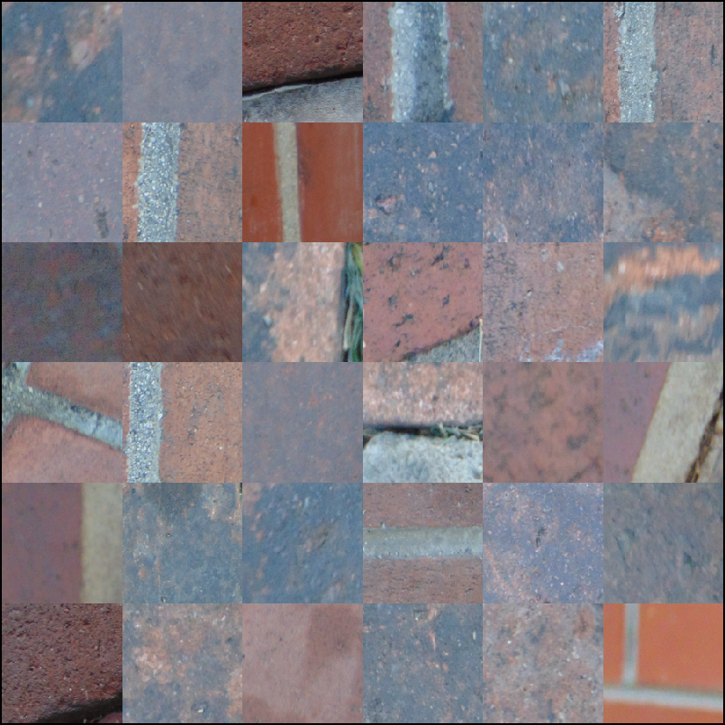
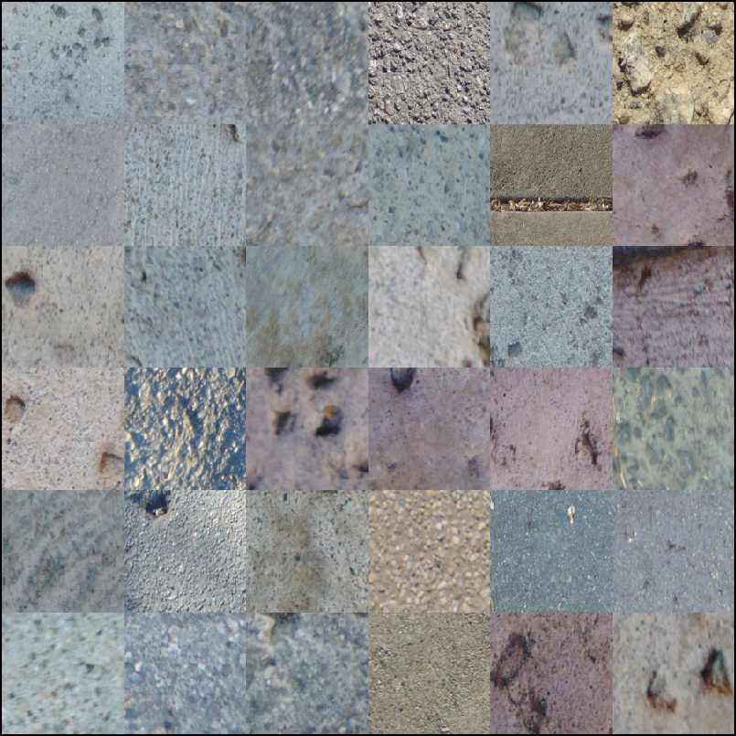
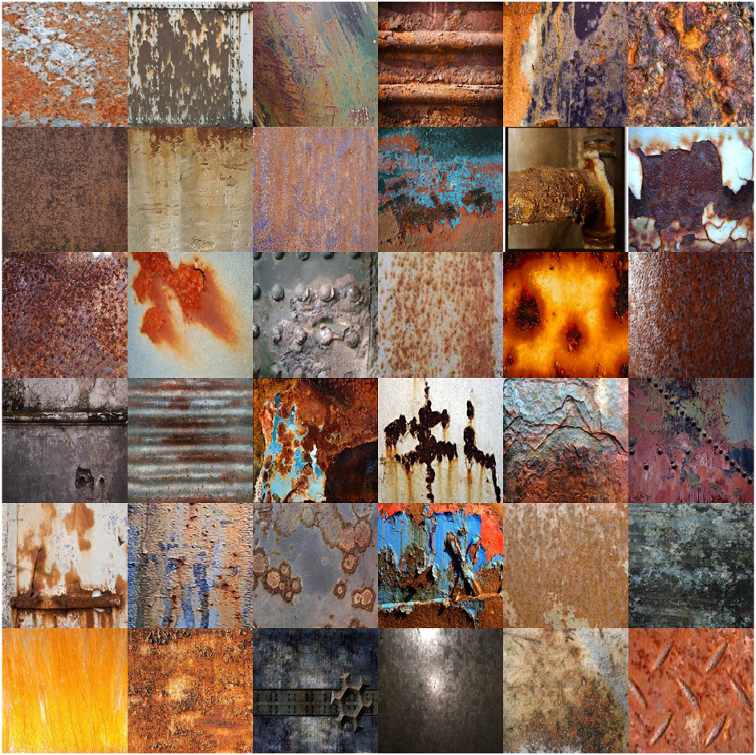
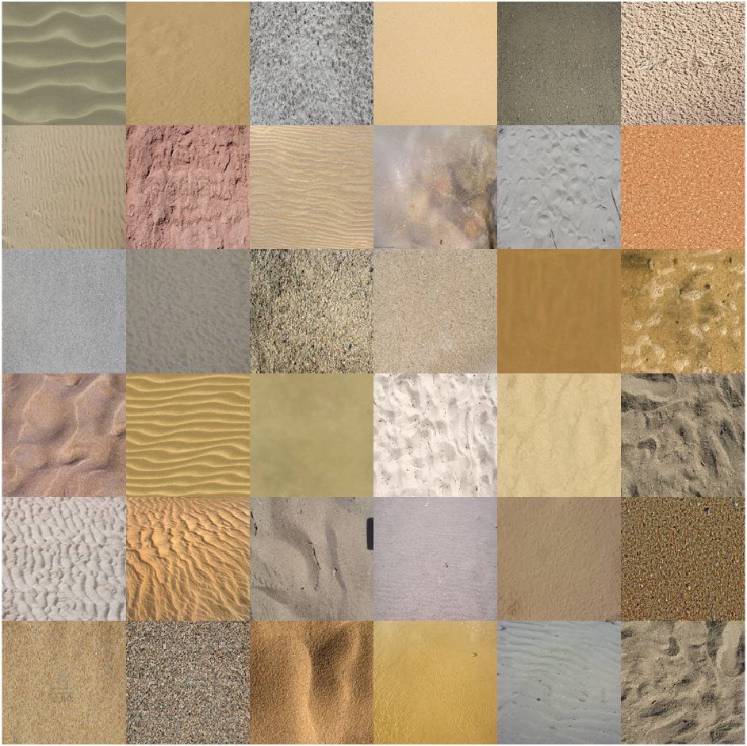
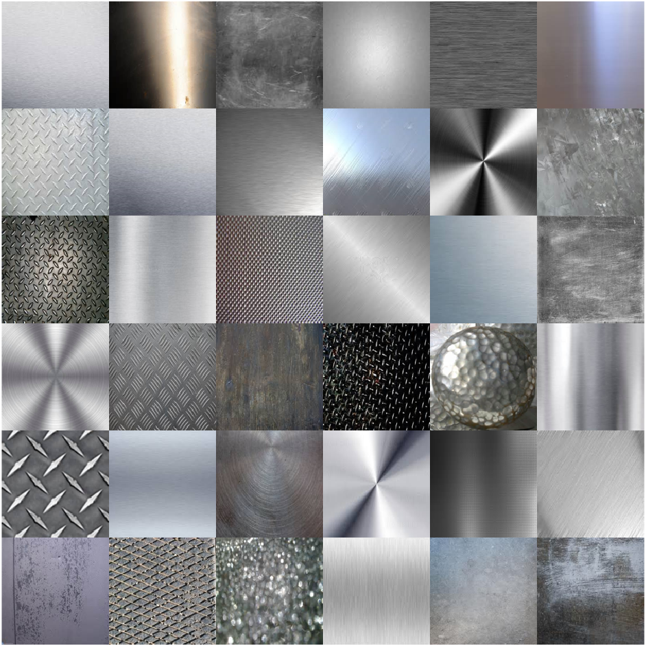
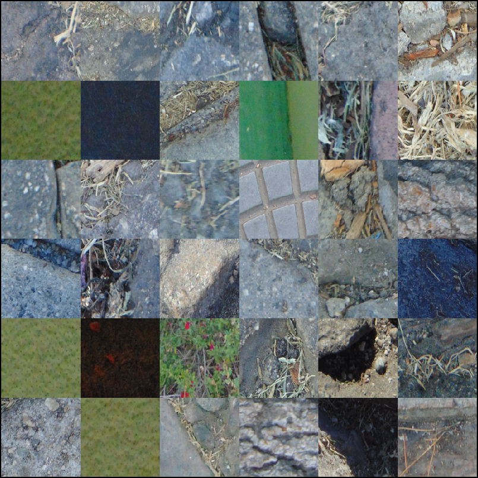

# Texture datasets (Textures-97.1K)
Textures are the naturally occuring feel or apperance of an object or material or substance. Textures can be used to classify the type of materials and more. Deep learning and machine learning-based supervised classification methods requires carefully annotated images for the texture classification. Furthermore, for the synthesis of textural images this datasets can be used. This is a repository of human annotated texture classification datasets of concrete, corrosion, pavement, sand and steel surfaces. I collected these datasets during my Ph.D. days in 2014 by web harvesting.

## Datasets examples
| No. | Texture type | Texture images |
| ------------- | ------------- |  ------------- |
| 1 | [Brick](https://1drv.ms/f/c/49b23bc11eecd6a8/EubupOBGWJtEvF0k7UAZWp8BIQPPMVf8_vpRguDsFIyRUA?e=xcveGy) |  |
| 2 | [Concrete](https://1drv.ms/f/c/49b23bc11eecd6a8/EkmCuBvfCSNHs4HMkRwc9XcBUWQ2Ev9L-ahTnk1FpzyP9g?e=z86KwG) |  |
| 3 | [Corrosion](https://1drv.ms/f/c/49b23bc11eecd6a8/Ep0bdmzzWH1Lp9xqS37eLpMBxquTSF4NgGtzzRzwua_6Zw?e=B2Q98I) |  |
| 4 | [Pavement](https://1drv.ms/f/c/49b23bc11eecd6a8/ElWnZqJcPa1Cm7E_U52vo28Bz3n94hAoPW6nS2u8DlT_DA?e=Fud0o5) |  |
| 5 | [Sand](https://1drv.ms/f/c/49b23bc11eecd6a8/EuOUokwOoEhJobelGsOklpQBSAVPbnvC0w9zCA94lmOOuA?e=tqrUV1) |  |
| 6 | [Steel](https://1drv.ms/f/c/49b23bc11eecd6a8/EkHY8pDxENBEsV95goyplN8Bj61Yyp9_6eONBms_zMq2-g?e=ZSMEdp) |  |
| 7 | [Wild](https://1drv.ms/f/c/49b23bc11eecd6a8/Etqjvbq_5hhEn3y8cUP5uAYBuoPFLh9PjPDyIZW2UnDGWQ?e=j1mrdY) |  |

# Citation
All texture datasets are available to the public. If you use any of these datasets in your research, please use the following BibTeX entry to cite:
```bibtex
@PhdThesis{preetham2021vision,
author = {{Aghalaya Manjunatha}, Preetham},
title = {Vision-Based and Data-Driven Analytical and Experimental Studies into Condition Assessment and Change Detection of Evolving Civil, Mechanical and Aerospace Infrastructures},
school =  {University of Southern California},
year = 2021,
type = {Dissertations & Theses},
address = {3550 Trousdale Parkway Los Angeles, CA 90089},
month = {December},
note = {Condition assessment, Crack localization, Crack change detection, Synthetic crack generation, Sewer pipe condition assessment, Mechanical systems defect detection and quantification}
}
```

# Acknowledgements
I thank Shravan Ravi, Vinay Hegde, and Milind Bhat (chronological order) for their efforts in the collection and preparation of the crack and non-crack concrete and pavement surface image database around the University of Southern California (USC) campus at Los Angeles, USA. I thank Dr. Azarang Golmohammadi who web harvested cracks images of concrete (407 numbers), corrosion, pavement (28 numbers), sand, and steel images.  In addition, I thank Ajay Kumar V. for his conscientious efforts in creating concrete and pavement classification annotations.

# Feedback
Please rate and provide feedback for the further improvements.
